### Altering Table Schema
We can change the schema and it will auto convert all of the data to the new schema all while the application running. It can do an ALTER TABLE while it's live.
We can so alter indexs, uniqueness constraints, foreign keys, and run on a live DATABASE.
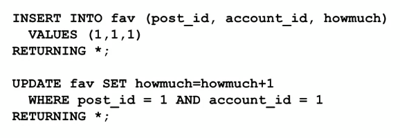
So, we can read SQL statements from a file like this: `\i <name of file>`
### Dates
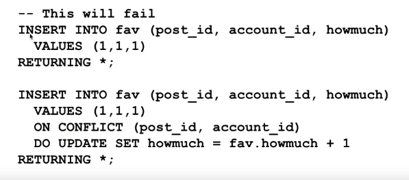
Setting default value:
* We can save some code by auto-populating date fields when a row is inserted  
* We will auto-set on updates later  
  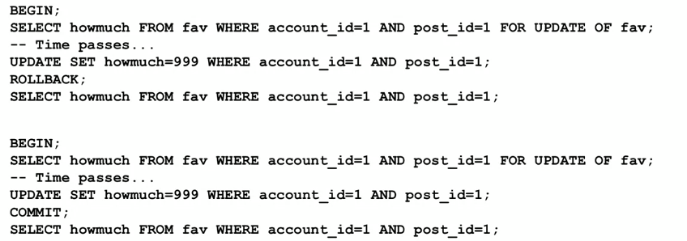  
##### TIMESTAMPZ - Best Practice  
* Store time stamps with timezone  
* Prefer UTC for stored time stamps  
* Convert to local time zone when retrieving  
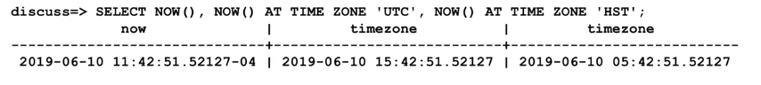
Casting to different types:
* We use phrase 'casting' to mean convert from  one type to another.
* Postgres has several forms of casting
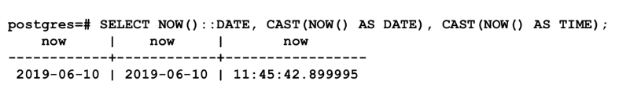
We can do date interval arithmetic:
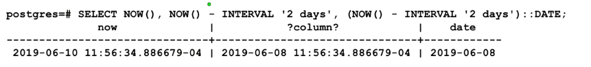
Using date_trunc():
* Sometimes we want to discard some of the accuracy that is in a TIMESTAMP
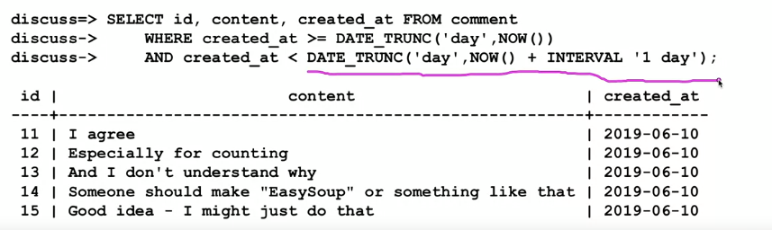
##### Performance: table scan
* Not all equivalent queries have the same performance
Sometime the way you express a query, the way it has to do is retrieve a lot of rows from the DB and the look at every single one of those rows ---> That's the slow way to do it, and we call those things table scans. Exp: We've got to read all the table and use an if statement, like a loop in an if statement, to read all the records..
=> A WHERE clause where you don't read all records is where you have like a unique index on a string field
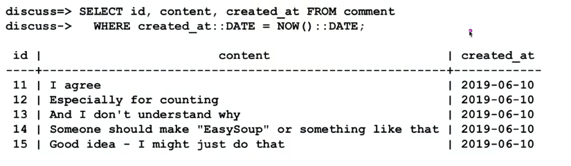
### DISTINCT / GROUP BY
Reducing the result set:
* DISTINCT only returns unique row in a result set - and row will only appear once
* DISTINCT ON limits duplicate removal to a set of columns
* GROUP BY is combined with aggregate function like COUNT(), MAX(), SUM(), AVE(),...

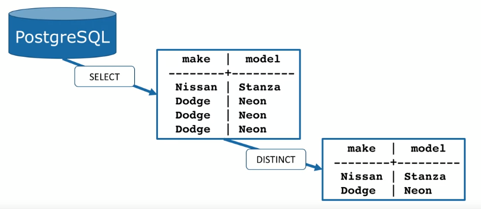
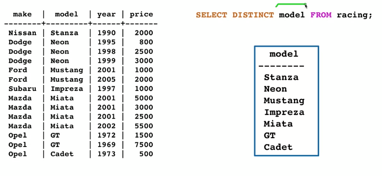

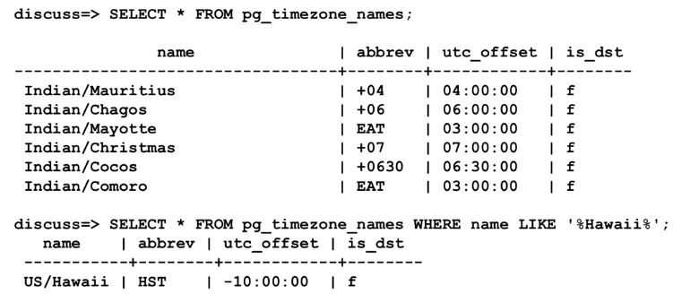
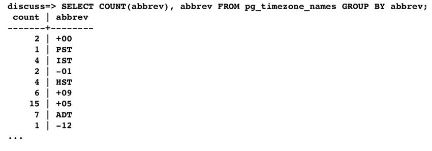
### HAVING clause
HAVING clause is like a WHERE clause. If in the statement we have to use WHERE clause twice. So in the WHERE 2nd, we will call HAVING. But it has a different. COUNT() clause can place after the HAVING but cannot for WHERE clause.
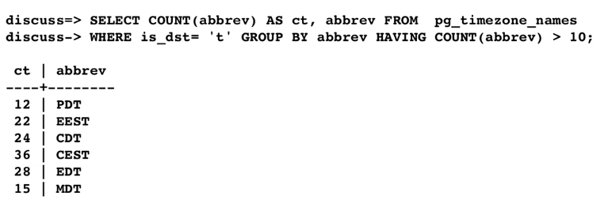
### SUB-QUERY
**A query within an query**
* Can use a value or set of values in a query tha are computed by another query
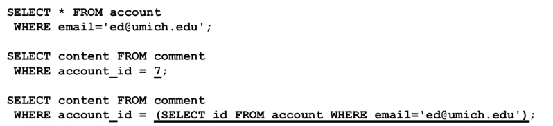
But it will affect to performance. It has to optimaize query twice. It's like stop everything, run the inner select, take those result and put them in the table, and this is a temperary table, then continue run the outer select (do the next thing based on reading a temperary table)
When we don't use sub-query we have given the DB potential to optimize it.  
### Concurrency
Databases are designed to accept SQL commands from a variety of sources simultaneously and make them atomically.  
### Transaction and Atomicity
* To implement atomicity, PostgreSQL "locks" areas before it starts an SQL command that might change an area of the database.
* All other access to that area must wait until the area is unlocked
* 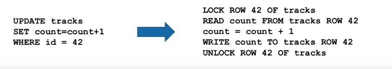
**Single SQL statements are Atomic**
* All the inserts will work and get a unique primary key
* Which account gets which key is not predictable
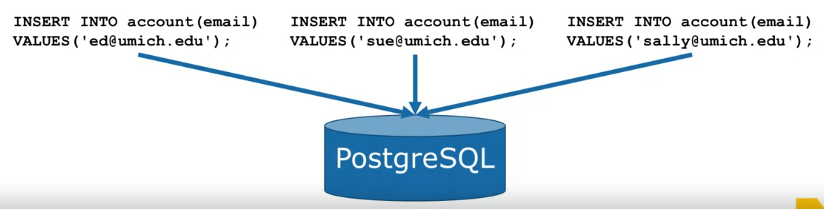
