### Altering Table Schema
We can change the schema and it will auto convert all of the data to the new schema all while the application running. It can do an ALTER TABLE while it's live.  
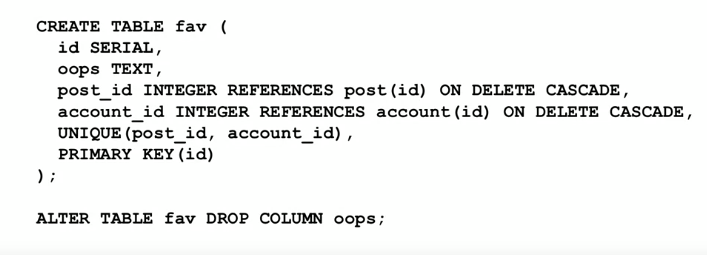  
We can so alter indexs, uniqueness constraints, foreign keys, and run on a live DATABASE.
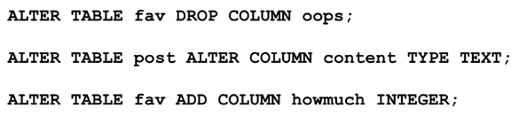  
So, we can read SQL statements from a file like this: `\i <name of file>`
### DATES
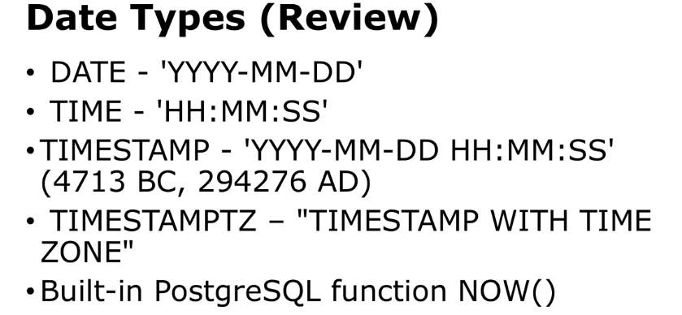  
Setting default value:
* We can save some code by auto-populating date fields when a row is inserted  
* We will auto-set on updates later  
  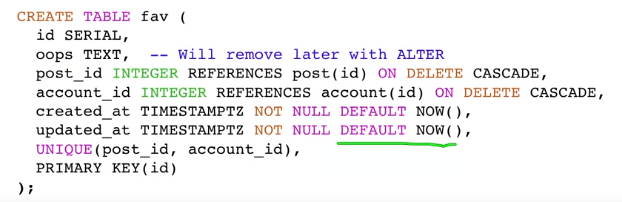    
##### TIMESTAMPZ - Best Practice  
* Store time stamps with timezone  
* Prefer UTC for stored time stamps  
* Convert to local time zone when retrieving  
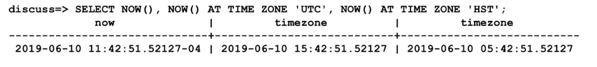  
Casting to different types:
* We use phrase 'casting' to mean convert from  one type to another.
* Postgres has several forms of casting
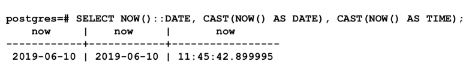  
We can do date interval arithmetic:
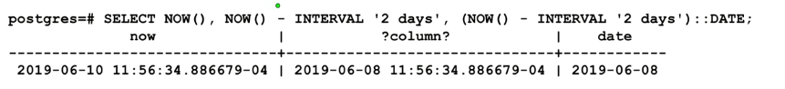  
Using date_trunc():
* Sometimes we want to discard some of the accuracy that is in a TIMESTAMP
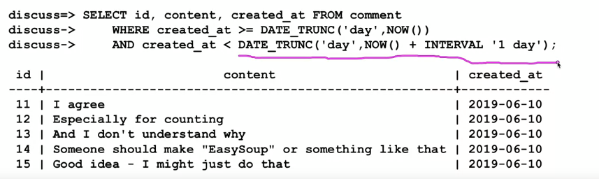  
##### Performance: table scan
* Not all equivalent queries have the same performance
Sometime the way you express a query, the way it has to do is retrieve a lot of rows from the DB and the look at every single one of those rows ---> That's the slow way to do it, and we call those things table scans. Exp: We've got to read all the table and use an if statement, like a loop in an if statement, to read all the records..
=> A WHERE clause where you don't read all records is where you have like a unique index on a string field
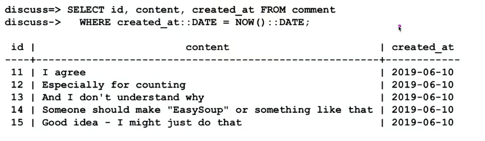  
### DISTINCT / GROUP BY
Reducing the result set:
* DISTINCT only returns unique row in a result set - and row will only appear once
* DISTINCT ON limits duplicate removal to a set of columns
* GROUP BY is combined with aggregate function like COUNT(), MAX(), SUM(), AVE(),...

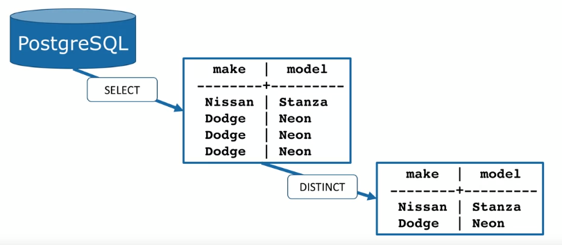  
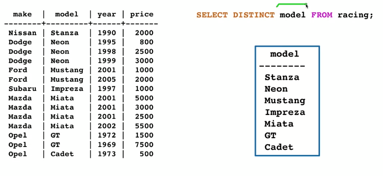  
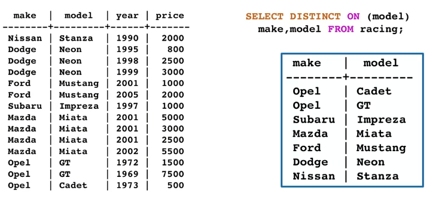  
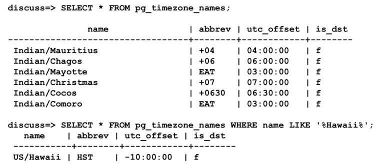  
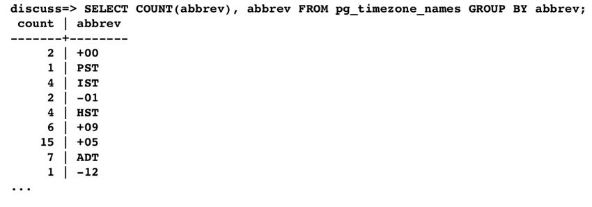  
### HAVING clause
HAVING clause is like a WHERE clause. If in the statement we have to use WHERE clause twice. So in the WHERE 2nd, we will call HAVING. But it has a different. COUNT() clause can place after the HAVING but cannot for WHERE clause.
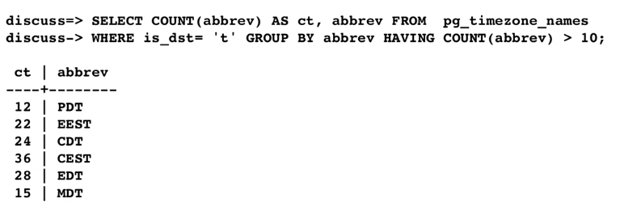
### SUB-QUERY
**A query within an query**
* Can use a value or set of values in a query tha are computed by another query
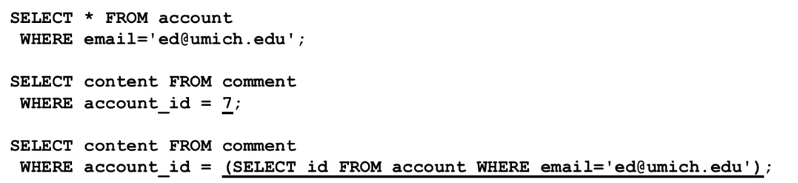  
But it will affect to performance. It has to optimaize query twice. It's like stop everything, run the inner select, take those result and put them in the table, and this is a temperary table, then continue run the outer select (do the next thing based on reading a temperary table)
When we don't use sub-query we have given the DB potential to optimize it.  
### Concurrency
Databases are designed to accept SQL commands from a variety of sources simultaneously and make them atomically.  
### Transaction and Atomicity
* To implement atomicity, PostgreSQL "locks" areas before it starts an SQL command that might change an area of the database.
* All other access to that area must wait until the area is unlocked
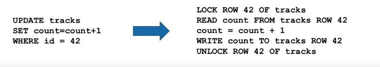  
**Single SQL statements are Atomic**  
* All the inserts will work and get a unique primary key
* Which account gets which key is not predictable
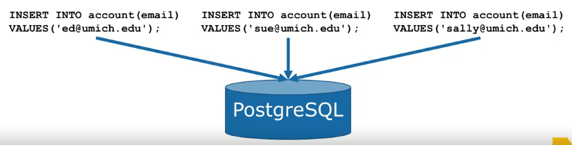  
**Compound Statements**  
* There are statements which  do more than one things in one statement for efficiency and concurrency.  

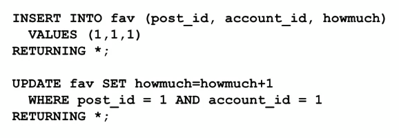

**One Conflict**
- Sometimes you "bump into" a constraint on purpose  

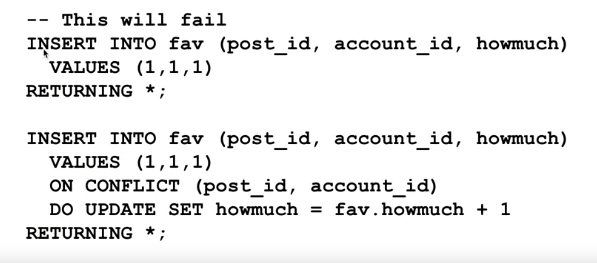

**Multi-Statement Transactions**

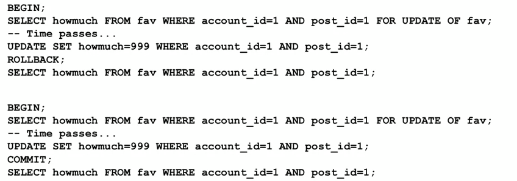

**Transaction and Performance**
The implement of transactions make a big difference in database performance:
- Lock granularity
- Lock implementation

**Transaction topics**
- Lock strength UPDATE, NO KEY UPDATE
- What to do when encountering a lock(WAIT), NOWAIT, SKIP LOCKED  

### Stored Procedures

- A stored procedure is a bit of reusable code that run inside of the database server  
- Technically there are multiple language choices just use "pl/pgsql"
- Generally quite non-portable
- Usually the goal is have fewer SQL statements  

You should have a strong reason to use a stored procedure:
- Major performance problem
- Harder to test/modify
- No database portability
- Some rule that must be enforced

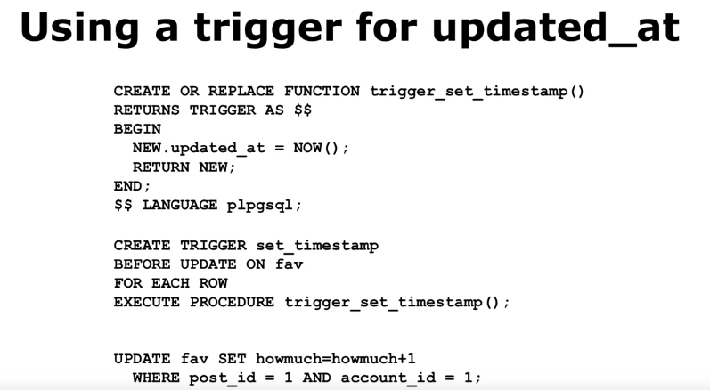

### Reading and Parsing Files  

### Assignment 

In this assignment you will read some [Unesco Heritage Site](https://whc.unesco.org/en/list/) data in comma-separated-values (CSV) format and produce properly normalized tables.  

Download that file [here](https://www.pg4e.com/tools/sql/whc-sites-2018-small.csv?PHPSESSID=e55d71b1b6456a14a72eb0ab9f869ec9%22)  

Firstly, I create some table as below:

```
DROP TABLE unesco_raw;
CREATE TABLE unesco_raw
 (name TEXT, description TEXT, justification TEXT, year INTEGER,
    longitude FLOAT, latitude FLOAT, area_hectares FLOAT,
    category TEXT, category_id INTEGER, state TEXT, state_id INTEGER,
    region TEXT, region_id INTEGER, iso TEXT, iso_id INTEGER);


CREATE TABLE category (
  id SERIAL,
  name VARCHAR(128) UNIQUE,
  PRIMARY KEY(id)
);

CREATE TABLE state (
  id SERIAL,
  name VARCHAR(256) UNIQUE,
  PRIMARY KEY(id)
);

CREATE TABLE region (
  id SERIAL,
  name VARCHAR(1024) UNIQUE,
  PRIMARY KEY(id)
);

CREATE TABLE iso (
  id SERIAL,
  name CHAR(2) UNIQUE,
  PRIMARY KEY(id)
);

CREATE TABLE unesco (
  id SERIAL,
  name VARCHAR(1024) UNIQUE,
  year INTEGER,
  longitude FLOAT, latitude FLOAT, area_hectares FLOAT,
  category_id INTEGER REFERENCES category(id) ON DELETE CASCADE,
  state_id INTEGER REFERENCES state(id) ON DELETE CASCADE,
  region_id INTEGER REFERENCES region(id) ON DELETE CASCADE,
  iso_id INTEGER REFERENCES iso(id) ON DELETE CASCADE,
  UNIQUE(name, category_id),
  PRIMARY KEY(id)
);
```

Then, load CSV data file into the unesco_raw table using the `\copy` command.  

```
\copy unesco_raw(name,description,justification,year,longitude,latitude,area_hectares,category,state,region,iso) FROM 'whc-sites-2018-small.csv' WITH DELIMITER ',' CSV HEADER;
```
Adding HEADER causes the CSV loader to skip the first line in the CSV file.  

Next, nnsert all distinct values of category, state, region, and iso into their respective tables: category, state, region, and iso.  

```
INSERT INTO category (name) SELECT DISTINCT category FROM unesco_raw;
INSERT INTO state (name) SELECT DISTINCT state FROM unesco_raw;
INSERT INTO region (name) SELECT DISTINCT region FROM unesco_raw;
INSERT INTO iso (name) SELECT DISTINCT iso FROM unesco_raw;
```

Then set the category_id, state_id, region_id ,iso_id in the unesco_raw table.  

```
UPDATE unesco_raw
SET (category_id, state_id, region_id, iso_id) = (
  (SELECT id FROM category WHERE name = unesco_raw.category),
  (SELECT id FROM state WHERE name = unesco_raw.state),
  (SELECT id FROM region WHERE name = unesco_raw.region),
  (SELECT id FROM iso WHERE name = unesco_raw.iso)
);
```

Then use a INSERT ... SELECT statement to copy the corresponding data from the `unesco_raw` table to the `unesco` table.  

```
INSERT INTO unesco (
  name, 
  year,
  longitude ,
  latitude , 
  area_hectares ,
  category_id ,
  state_id ,
  region_id ,
  iso_id ) SELECT name, 
  year,
  longitude ,
  latitude , 
  area_hectares ,
  category_id ,
  state_id ,
  region_id ,
  iso_id FROM unesco_raw;

```

Finally, We can check again by this command: 
```
SELECT unesco.name AS Name, year AS Year, category.name AS Category, state.name AS State, region.name AS Region, iso.name AS Iso
  FROM unesco
  JOIN category ON unesco.category_id = category.id
  JOIN iso ON unesco.iso_id = iso.id
  JOIN state ON unesco.state_id = state.id
  JOIN region ON unesco.region_id = region.id
  ORDER BY iso.name, unesco.name
  LIMIT 3;
```

This is the result:
```
                                  name                                   | year | category |        state         |          region          | iso 
-------------------------------------------------------------------------+------+----------+----------------------+--------------------------+-----
 Madriu-Perafita-Claror Valley                                           | 2004 | Cultural | Andorra              | Europe and North America | ad
 Cultural Sites of Al Ain (Hafit, Hili, Bidaa Bint Saud and Oases Areas) | 2011 | Cultural | United Arab Emirates | Arab States              | ae
 Cultural Landscape and Archaeological Remains of the Bamiyan Valley     | 2003 | Cultural | Afghanistan          | Asia and the Pacific     | af
(3 rows)
```

